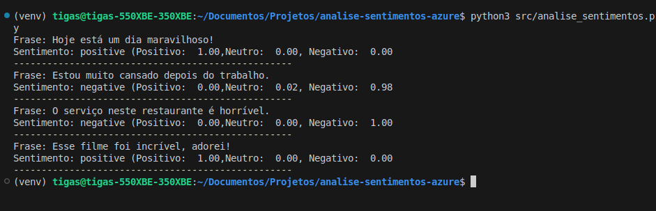
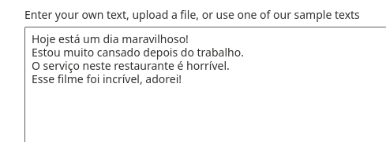
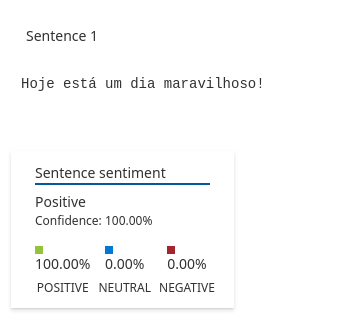
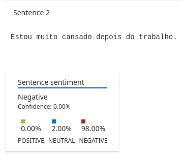
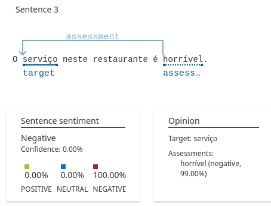
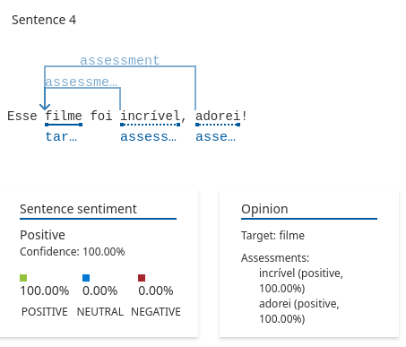

# Análise de Sentimentos com Azure e Python

Este projeto utiliza a API de Análise de Sentimentos do **Azure Cognitive Services** para analisar o sentimento de frases presentes em um arquivo de texto. 

O código foi desenvolvido em Python e usa pacotes como `azure-ai-textanalytics` e `python-dotenv` para a integração com o Azure e para carregar variáveis de ambiente de forma segura.


## 📸 Prints do Projeto

### 🔹 Exemplo de Saída no Terminal


### 🔹 Exemplo de Saída na Plataforma da Azure







## Requisitos

- Python 3.7 ou superior
- Conta no **Azure** com acesso à API de Análise de Sentimentos
- Bibliotecas Python necessárias


## Estrutura do Projeto

A estrutura do projeto é a seguinte:

/analise-sentimentos-azure
│
├── /src
│   └── analise_sentimentos.py    # Código principal para análise de sentimentos
├── /inputs
│   └── frases.txt               # Arquivo com as frases para análise
├── .env                         # Arquivo com as credenciais da API do Azure
├── requirements.txt             # Lista das dependências do projeto
└── README.md                    # Este arquivo
## Instalando as Dependências

Primeiro, crie um ambiente virtual para o projeto. No terminal, navegue até o diretório do projeto e execute:

```bash
python3 -m venv venv
source venv/bin/activate  # Para Linux/macOS
venv\Scripts\activate     # Para Windows

Em seguida, instale as dependências do projeto usando o pip:

pip install -r requirements.txt

Ou se preferir, você pode instalar os pacotes manualmente:

pip install azure-ai-textanalytics azure-core python-dotenv


## Variáveis de Ambiente

O projeto usa o arquivo .env para armazenar as credenciais de acesso à API do Azure de forma segura. Certifique-se de criar um arquivo .env no diretório raiz do projeto com as seguintes variáveis:

AZURE_API_KEY=your_api_key_here
AZURE_ENDPOINT=your_endpoint_here


## Obtendo as Credenciais do Azure

    Acesse o portal do Azure e crie um Cognitive Services Resource.

    No painel do seu recurso, localize a chave da API e o endpoint para a Análise de Sentimentos.

    Substitua your_api_key_here e your_endpoint_here pelas suas credenciais no arquivo .env.
## Como Rodar

Para rodar o código, basta executar o script Python que realiza a análise de sentimentos:

python src/analise_sentimentos.py

O script irá ler o arquivo frases.txt e enviar as frases para análise de sentimentos utilizando a API do Azure. O resultado será exibido no terminal, mostrando o sentimento (Positivo, Neutro, Negativo) de cada frase, com a respectiva confiança em cada categoria.
Exemplo de Saída

Frase: Eu amo programar!
Sentimento: positivo (Positivo: 0.98, Neutro: 0.02, Negativo: 0.00)
--------------------------------------------------
Frase: Estou tão cansado hoje.
Sentimento: negativo (Positivo: 0.10, Neutro: 0.30, Negativo: 0.60)
--------------------------------------------------


## Contribuindo


Se você deseja contribuir para este projeto, por favor, siga os seguintes passos:

    Faça um fork do repositório.

    Crie uma nova branch (git checkout -b minha-nova-feature).

    Faça suas alterações e commit (git commit -am 'Adicionando nova feature').

    Envie para o repositório remoto (git push origin minha-nova-feature).

    Abra um Pull Request.


## Licença


Este projeto está licenciado sob a MIT License - veja o arquivo LICENSE para mais detalhes.
